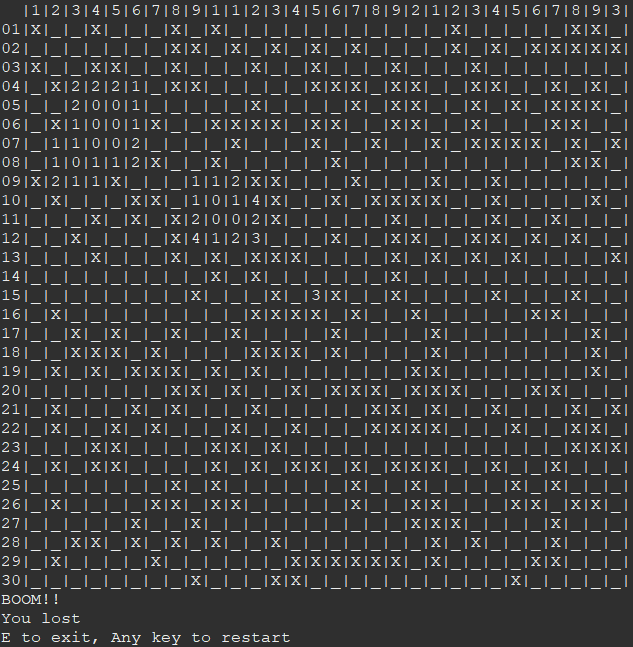

# Minesweeper

<!-- {add test badges here, all projects you build from here on out will have tests, therefore you should have github workflow badges at the top of your repositories: [Github Workflow Badges](https://docs.github.com/en/actions/monitoring-and-troubleshooting-workflows/adding-a-workflow-status-badge)} -->

## Demo & Snippets

---

## Requirements / Purpose

### Purpose

To implement OOP, newly developed java skills and to create a functioning java CLI project.

### MVP

- Recreate a simplified version of the game Minesweeper to be played in the java console
- The game should be able to randomly generate 10 mines in a 10x10 grid

  - Grid will be represented by a 2 dimensional array (or array like structure)

- The user will be able to enter a command that represents a coordinate to check a location for a mine

  - (e.g "00" or "19" or "X: 0, Y: 9")

- After every guess the application should "redraw" the 2d grid. Releaving either a number from 0-8 depending on how many mines surround that location (based on the cooridnate)
- If the user selects a mine, the game will respond "boom!" and the game will be lost
- Game over screen and exit the application

- If every non-mine square has been revealed, the game is won
- Render the grid to the console after every user command

- Allow for the user to configure number of mines and grid size via a configuration.json file OR command line arguments
- Keep track of win/loss in a file
- (Difficult) Discovering an empty square should reveal all squares around it, and cascade into other nearby empty squares

- MVP
- purpose of project
- stack used and why

---

## Build Steps

If you are using an IDE you can simply open the project within the IDE and run the code on on MineSweeper.java

If you are using the terminal or git bash

---

## Design Goals / Approach

My goal for this project was to get to as close as a normal minesweeper game as i could get it, because I wanted to be as faithful as possible to the original. That involved the cascading effect, displaying all the mines after you have activated one.

---

## Features

- Cascading Effect, revealing the cells without an mines or cells that are next to mines
- Revealing all mines after one has been set off
- Changing the board size
- Displaying proper co-ordinates for the user
- Tracking the number of games played, and the score

---

## Known issues

1. ~~When entering a single digit co-ordinate (eg 1) instead of the double cor-odrinate (eg .1:2), it will return a out of bounds exception~~ (Fixed)
2. ~~When prompted to restart and a user accepts, scanner close exception occurs~~

---

## Future Goals

- Create a Graphical Interface
- Flag mines
- Discover mines around a cell when all the adjacents mines have been flagged
- Different colours for adjacent nextToMine numbers

---

## Change logs

### Date 11/05/23:

#1: I was trying to store a variable as an integer without testing to see if it could have been an integer, undefined, or null. Fix was to removing move store it into the variable if it passed the check.

#2: Scanner .close() method was called at the incorrect time.

---

## What did you struggle with?

### Recursion - Cascading Effect

The method cascadeEffect on the Board class, initial was a for loop with an if statement inside. I thought that the if statement inside the for loop would be enough for the method to know when to break, but clearly it wasn't. This then lead me down a rabbit hole of trying to fix tthe if statement inside, believing that was the problem. But then i remembered that recursion is already a loop and that I needed to have a break outside of the for loop not within, the most important rule when it comes to recursion.

What I learnt was that I need to take a step back and look at the problem from a broader perspective when I feel stuck.

---

<!-- ## Licensing Details

- What type of license are you releasing this under?

--- -->

<!-- ## Further details, related projects, reimplementations

- Is this project a reimplementation for something you've done in the past? if so explain it and link it here.
- If it's an API, is there a client app that works with this project? link it -->
